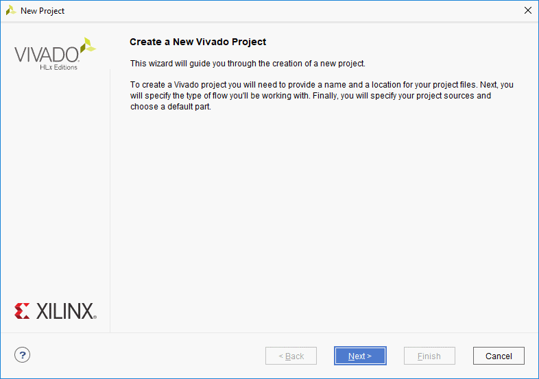
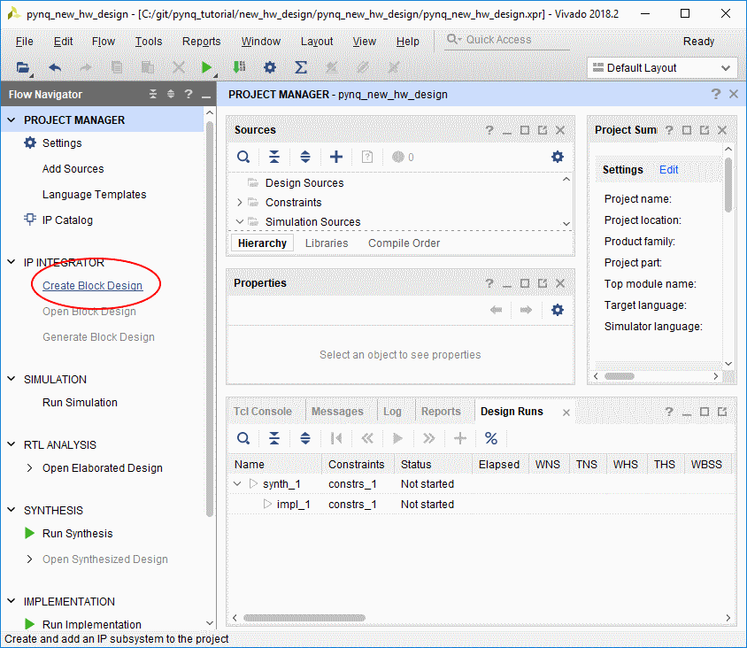
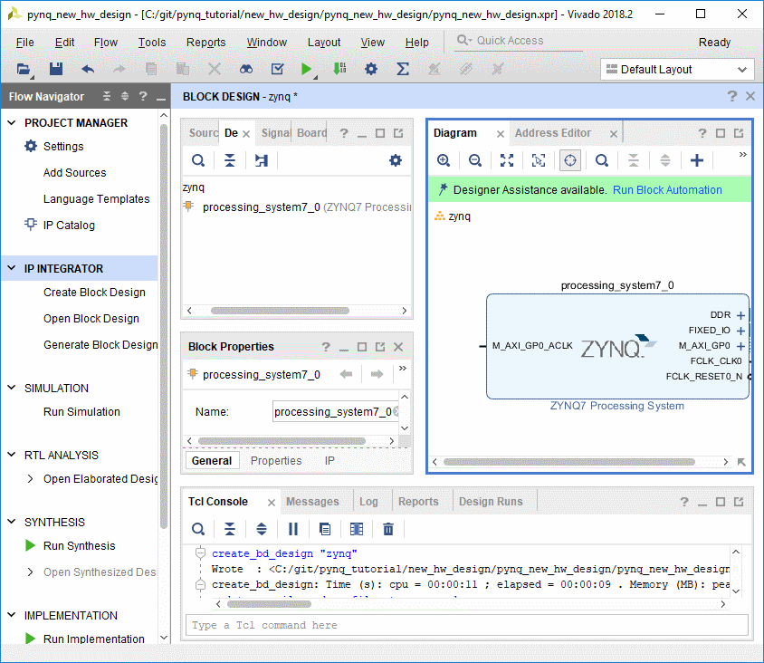
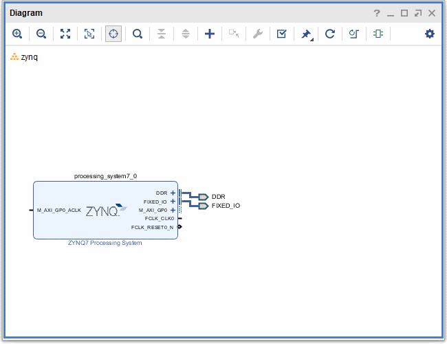
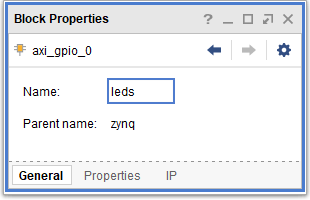
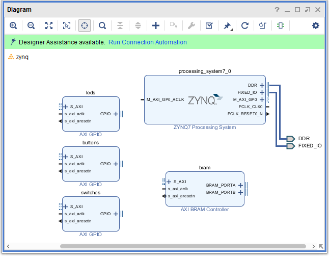
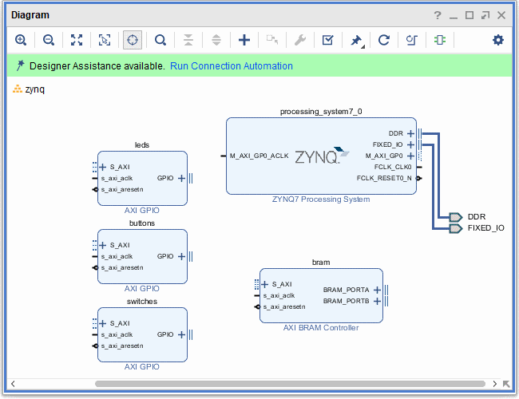
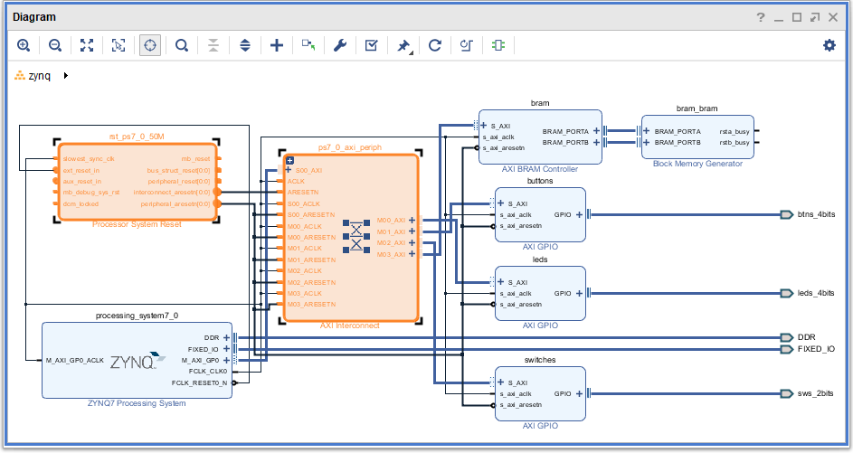
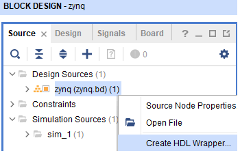

# Creating a new hardware design for PYNQ

The tutorial will show you how to create a new Vivado hardware design for PYNQ. This tutorial is based on the v2.3 PYNQ image and will use Vivado 2018.2. 

If you are using the PYNQ-Z1 or PYNQ-Z2, first make sure the board files have been installed. Download the [PYNQ-Z1 board files](https://github.com/cathalmccabe/pynq-z1_board_files/raw/master/pynq-z1.zip) or the [PYNQ-Z2 board files](https://d2m32eurp10079.cloudfront.net/Download/pynq-z2.zip), extract and copy to your Vivado installation, in the ./data/boards/board_files directory. 

## Create a new Vivado project

This tutorial will create a design for the PYNQ-Z2 (Zynq) board. You should be able to follow the instructions to create a similar design for other Zynq or Zynq Ultrascale+ boards. 

* Open Vivado and create a new project. Select your Zynq board as the target. In this example, the PYNQ-Z2 is selected.

* Create a new *IP Integrator* Block Design
* In the block design, Add a new *ZYNQ7 Processing System* (PS) block for Zynq or a *Zynq UltraScale+ MPSoC* block for Zynq UltraScale+

Zynq is a System-on-chip. It includes an ARM processor, FPGA logic, and also memory controllers, and peripherals including USB, Ethernet, SD card. The Zynq PS is configured at boot time. 

In a Vivado design, the Zynq PS settings can be configured. Vivado is used to generate the Programmable logic design (bitstream). It can also be used to generate a boot image which includes all the code to boot the processor as well as the bitstream. 

However, the PYNQ SD card image is used to boot a board. PYNQ overlays can be loaded after the system has booted. This means that when we create a Zynq design in Vivado, we only need to create the programmable logic design and can ignore the Zynq PS configuration settings. However, it is good practice to apply the correct board settings for your board. 

You will need to enable ports and interfaces on the PS block so you can connect them to your custom design. 

## Block Automation

On adding the Zynq PS block, a message should appear giving the option to *Run Block Automation*. Click on this message to run this process. This applies a default configuration for the PS for your board. 

You are now ready to start creating your design. 

In the block diagram, add the following blocks:

* 3x AXI GPIO controller
* 1x AXI BRAM

The block are all given default names. E.g. axi_gpio_0, axi_gpio_1 etc. These names will be visible from Python later, so it is useful to rename them to something meaningful. 

* Select each AXI GPIO block, find the *Block Properties* window, and rename each IP to **leds**, **buttons**, and **switches** respectively

* Rename *axi_bram_ctrl_0* to **bram**

You can manually create wires and connect ports, but IP Integrator can also to this automatically using *connection automation*. 

* Click on  *Run connection automation* to open the dialog box
* Check the box beside **All Automation**
* Select each of the AXI GPIO blocks (buttons, leds, switches) (make sure you don't uncheck the box when selecting) 
* For each block, under the *Options* section select the corresponding interface. i.e. buttons: *btns_4bits*, leds: *leds_4bits*, switches: *sws_2bits* 

This will connect each AXI GPIO to the corresponding pins on the board.

* Click **OK** to run connection automation 

This will automatically connect each IP block in the system, add ports, and any additional blocks as required. 

You should notice two extra blocks have been added to your design (orange in the figure above), along with ports for the buttons, leds, and switches interfaces. The new IP blocks are a *System Reset* block, to manage reset signals, and an *AXI Interconnect* block to connect the three AXI GPIO blocks and the AXI BRAM to a single AXI GP port.

The design is now finished. 

* In the Source tab, right click on the zynq.bd (block diagram file) and select **Create HDL Wrapper**

* In Vivado click on **Generate Bitstream** (under Program and Debug) from the bottom of the *Flow Navigator*. (You can click "cancel" when the bitstream is generated, or if you want to you can examine reports, or open the implemented design.)

The .bit files should be available from this path

* ./<vivado project>/<project name>/<design name>.runs/impl_1/

You may notice a number of information, warning, messages in the  (although hopefully there will not be any error messages for this design!). These messages can be ignored for now. 

* Once the bitstream has been created, generate the corresponding Tcl for the design by selecting **File > Export > Export Block Design**. (Make sure the block design is open when doing this.) 

You have now created the bitstream file (.bit) and Tcl file (.tcl). 

The next tutorial will cover using the PYNQ interfaces to communicate with the design. 

## Terminology

AXI - Advanced eXtensible Interface - an interconnect that is part of the ARM AMBA standard. Most Xilinx IP supports this standard, and it is used in Vivado IPI to connect IP together. 

GPIO - General Purpose Input Output.

GP - Zynq General Purpose AXI port(s). Used to connect peripherals that will be controller from the Zynq processing system.

HP - Zynq High Performance AXI port(s). Used to connect IP directly to the Zynq memory controller. This allows IP to access the Zynq memory system directly. 

IP Integrator - The Vivado graphical environment to create hardware designs (block designs) for Zynq. 

BRAM - Block RAM (Memory)  on Xilinx devices. 

PL - Programmable Logic - the FPGA part of the Zynq chip.

PS - Processing System - the ARM processor, peripherals and memory controller inside a Zynq chip.

