# PYNQ DMA tutorial (Part 1: Hardware design)

This tutorial will show you how to use the Xilinx AXI DMA with PYNQ. It will cover adding the AXI DMA to a new Vivado hardware design and show how the DMA can be controlled from PYNQ. This tutorial is based on the v2.6 PYNQ image and will use Vivado 2020.1. If you are using a different PYNQ version you should be able to follow the same steps in this tutorial, but you should make sure you are using the supported version of Vivado for that PYNQ release. 

The PYNQ-Z2 board was used to test this design.

## References

If you are new to Zynq design, I recommend you review a previous tutorial which shows how to build a Vivado hardware design for use with PYNQ. 

* [PYNQ Tutorial: Create a hardware design]()

* [Xilinx PG021 AXI DMA product guide](https://www.xilinx.com/support/documentation/ip_documentation/axi_dma/v7_1/pg021_axi_dma.pdf) includes technical details on the DMA and explains in more detail the register map that is used in this tutorial. 

* [Zynq UG 585 Technical Reference Manual](https://www.xilinx.com/support/documentation/user_guides/ug585-Zynq-7000-TRM.pdf)
* The [Zynq Book](http://www.zynqbook.com/), introductory guide to Zynq

## Create a new Vivado project

This tutorial will create a design for the PYNQ-Z2 (Zynq) board. You should be able to follow the instructions to create a similar design for other Zynq or Zynq Ultrascale+ boards. The steps for other Zynq boards should be the same. There will be modifications for Zynq Ultrascale+ (E.g. PS settings) that won't be covered now, but you can ask questions in the comments or post a new question to the support forum. . 

The first step for every Zynq hardware design is to add and configure the PS block. Rather than repeat the instructions [Create a hardware design](https://discuss.pynq.io/t/tutorial-creating-a-hardware-design-for-pynq/145?u=cathalmccabe). If you are new to Vivado and creating Zynq designs, I would recommend you at least read through all of this tutorial. 

Follow the steps in the [Create a hardware design](https://discuss.pynq.io/t/tutorial-creating-a-hardware-design-for-pynq/145?u=cathalmccabe) tutorial to create a Vivado project, and add and configure the Zynq PS block with default settings. Stop just before the section on *Adding blocks to your design* and continue with this tutorial:

## Adding the DMA

In the Vivado block diagram which should contain the Zynq PS block, add the **AXI Direct Memory Access** block to your design. You should see the following IP block. You see the ports for the default configuration of this IP.  

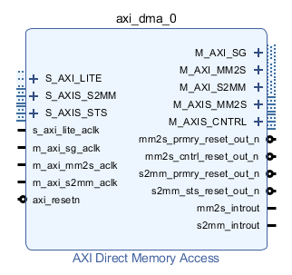

The name of the AXI IP will be visible later from Python, so it is good practice to rename IP blocks from the default, even if it is only to remove the training "\_0" 
* Select the block and rename it to **dma** 

## DMA background

The DMA  allows you to stream data from memory, PS DRAM in this case, to an AXI stream interface. This is called the *READ channel* of the DMA. The DMA can also receive data from an AXI stream and write it back to PS DRAM. This is the *WRITE channel*.

The DMA has AXI Master ports for the read channel, and another for the write channel, and are also referred to as *memory-mapped* ports - they can access the PS memory. The ports are labelled MM2S (Memory-Mapped to Stream) and S2MM (Stream to Memory-Mapped). You can consider these as the read or write ports to the DRAM for now. 

### Control port

The DMA has an AXI lite control port. This is used to write instructions to configure, start and stop the DMA, and readback status. 

### AXI Masters

There are two AXI Master ports that will be connected to the DRAM. M_AXI\_**MM2S** (READ channel) and M_AXI\_**S2MM** (WRITE channel). AXI masters can read and write the memory. In this design they will be connected to the Zynq HP (High Performance) AXI Slave ports. The width of the HP ports can be changed in the Vivado design, however these ports are configured when PYNQ boots the board. You need to make sure the width of the ports in your Vivado design matches the PYNQ boot settings. In all official PYNQ images, the width of the HP ports is 64-bit. 

If you set the HP ports to 32-bit if your design by mistake, you will likely see only 32-bits out of every 64-bits are transferred correctly. 

### AXI Streams

There are two AXI stream ports from the DMA. One is an AXI master Stream (M_AXI**S**\_MM2S) and corresponds to the *READ* channel. Data will be read from memory through the M_AXI_MM2S port and sent to the M_AXIS_MM2S port (and on to the IP connected to this port).
The other AXI stream port is an AXI Slave (S_AXI**S**\_S2MM). This is connected to your IP. The DMA receives AXI stream data from the IP, and writes it back to memory through the M_AXI_S2MM port. 

If the IP is not ready to receive data from the M_AXIS port, then this port will stall. You can also use AXI Stream FIFOs. If the IP tries to write back data but a DMA *write* has not started, the S_AXI**S** channel will stall the IP. Again, FIFOs can be used if required. The DMA has some built in buffering so if you are trying to debug your design you may see some (or all) data is read from memory, but it may not necessarily have been sent to your IP and may be queued interally or in the HP port FIFOs. 

### Scatter gather support

PYNQ doesn't support scatter gather functionality of the DMA. This is where data can be transfered from fragmented or disjointed memory locations. PYNQ only supports DMA from contiguous memory buffers. 
Scatter-Gather can be enabled on the DMA to allow transfers greater than 8MB (from contiguous memory buffers). If you do this, you need to use the SG M_AXI ports instead od the M_AXI ports. This is not covered in this tutorial. 
An alternative to SG for large transfers is to segment your memory transfer in software into <8MB chunks and run multiple DMA transfers. 

## Configure the DMA

* Double click the DMA to open the configuration settings

You should see the following default settings:

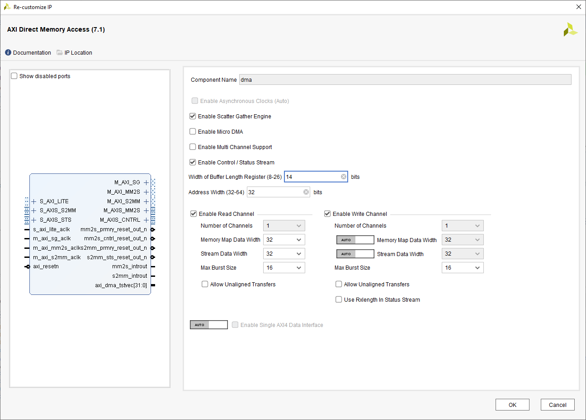

* Uncheck *Enable Scatter Gather Engine* to disable Scatter Gather

### Buffer Length Register

* Set the *Width of Buffer Length Register* to 26

This value determines the maximum packet size for a single DMA transfer. **width = 26** allows transfers of 8 Megabytes - the maximum size the DMA supports. I usually set this value to the maximum value of 26. If you know you will never need more than a smaller size transfer, you can set this to a smaller value and save a small amount of PL resources. I prefer to set the maximum value for flexibility as the hardware resource increase is relatively modest. 
When using the DMA if you try to do a transfer but only see that the first part of your buffer is transferred , check this value in your hardware design and check how much data you are transferring. Leaving the default with set to 14-bits is a common mistake which will limit the DMA to 2 Kilobyte transfers. If you try to send more than this the transfer will terminate once 2 Kilobytes is transferred. Remember to check the size of the transfer in *bytes*.

### Address width

* Check the address width is set to **32**. In this example, I will connect the DMA to the PS memory which is 32-bit for Zynq. You can set this up to 64-bit if you are connecting this to a larger memory, for example if you are using a Zynq Ultrascale+ or if your DMA is connected to a PL connected memory. 

## DMA read and write channels

This example will use both the read and write channels of the DMA, but you may only need to enable one of these channels. You could also have multiple DMAs in your design. 

* For this design, leave both both *read* and *write* channels enabled 
* Set the memory mapped data width to **64** match the HP port (defined in the PYNQ image and applied at boot time)

You can leave the write channel set to **auto** but you should check later that this gets updated to **64**.

* Set the stream data with to match your IP stream width. In this example I will leave it set to 32.

You can set different data widths and Vivado should add AXI interconnect to automatically step up or down your data widths, or give a warning if there is a mismatch in your design. For best results - efficient hardware implementation, and data flow, match the settings of the DMA to your datapath. 

You can increase the burst width to improve efficiency of your data transfers. There is usually a small hardware resource utilization will increase as you increase the max burst size, but this should not have a signifiant impact of the overall utilization. 

* Make sure *Allow unaligned transfers* is **NOT** enabled.

This is not supported with PYNQ. 

* Click OK to accept the changes. 

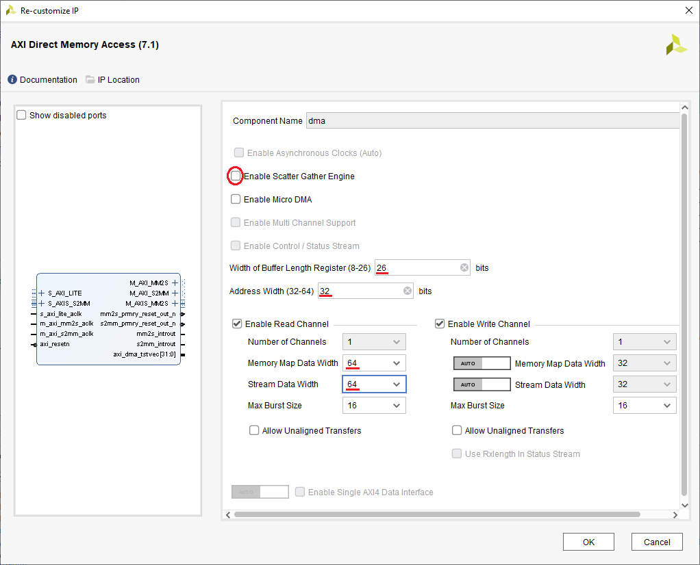

## Connect the DMA

* Click on *Run connection automation* to open the dialog box
* Check the **S_AXI_LITE** box under the dma and click **OK**

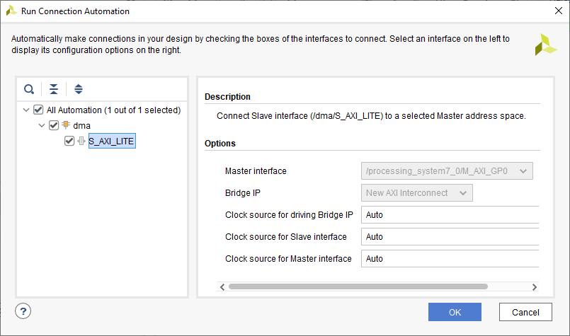

This connects the S_AXI_LITE port of the DMA to the Zynq PS M_AXI_GP0 port. This is the control port for the DMA. 

## Memory mapped connections

The DMA AXI master ports need to be connected to the PS DRAM. This will be done through the Zynq HP (AXI Slave) ports. These ports are not enabled by default. Internally there are two connections to memory that the four HP ports are connected to. HP0 and HP1 share a switch to one port, and HP2 and HP3 share a switch to the other. The difference may not be noticeable for this example and some design, but when only two HP ports are required, it is more efficient to connect them to HP ports that don't share a switch. i.e. HP 0 and HP 2 or HP 1 and HP 3 together. 

* Double click the Zynq PS block to open the customization settings
* Go to the PS-PL Configuration, expand HP Slave AXI Interface and enable S AXI HP0 and S AXI HP2

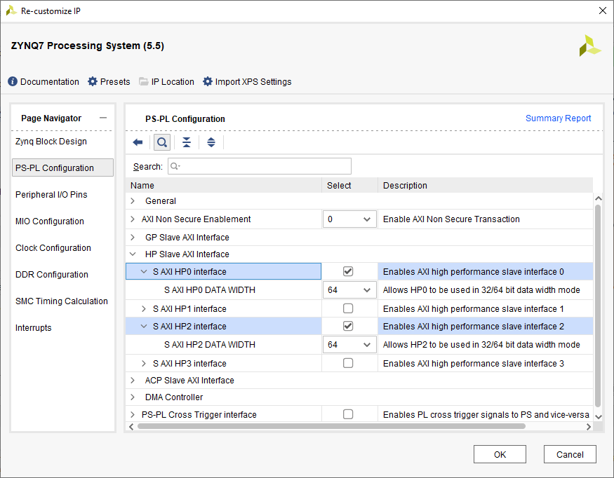

You can expand the S AXI HP ports and check the data width is set to 64. Remember, these data width settings are configured at boot time must match the size that was specified in your PYNQ image. This is 64 by default for PYNQ images. 

* Click **OK** to conform the changes

Notice the HP ports are enabled and *Run Connection Automation* is available again. 

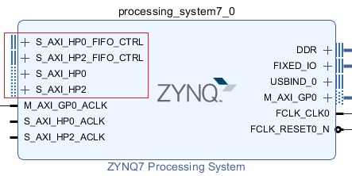

* Click on *Run connection automation* again
* Select *S_AXI_HP0* and for the *Master Interface* select **/dma/M_AXI_MM2S**
* Select *S_AXI_HP2* and this time select **/dma/M_AXI_S2MM** for the *Master Interface*  

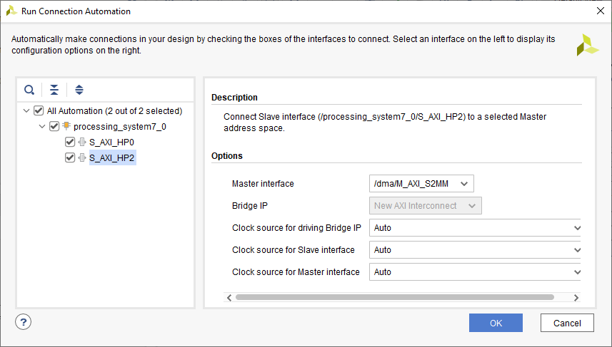

It doesn't matter which HP port a DMA master is connected to.  

* Click **OK** to accept the changes

The Block Design shoudl now look like this:

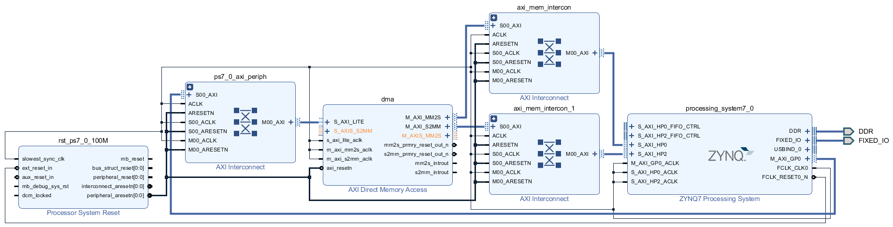

Only the DMA AXI Stream ports remain unconnected. 

### AXI Stream Ports

In this example I'm going to connect the AXI Stream ports in a loopback configuration. I could connect the ports directly to each other, but instead I will add an AXI Stream FIFO just to add some IP into the data path. In a real design you could replace the FIFO with your IP. In the next tutorial I will show how to add a HLS IP with AXI Stream ports to your design and use it with the DMA. For now we will add the FIFO:

* Add the **AXI4-Stream Data FIFO** to the design

There are several different FIFO IP blocks in the Vivado IP catalog. Make sure to select the correct one. 

We will use the default settings for the FIFO. Note that the AXI Stream sidebands or signal properties are set to *AUTO*. Some AXI signals are optional, and your design can function without them. The **TLAST** signals which is part of the AXI standard is required for the DMA to work properly. When creating your own IP, especially HLS IP you need to make sure this signal is included. This can be a common problem when working with the DMA. I'll cover this in more detail in a later tutorial. 

For this design Vivado will automatically infer the correct *sideband signals* for the AXI Stream interface to the FIFO. 

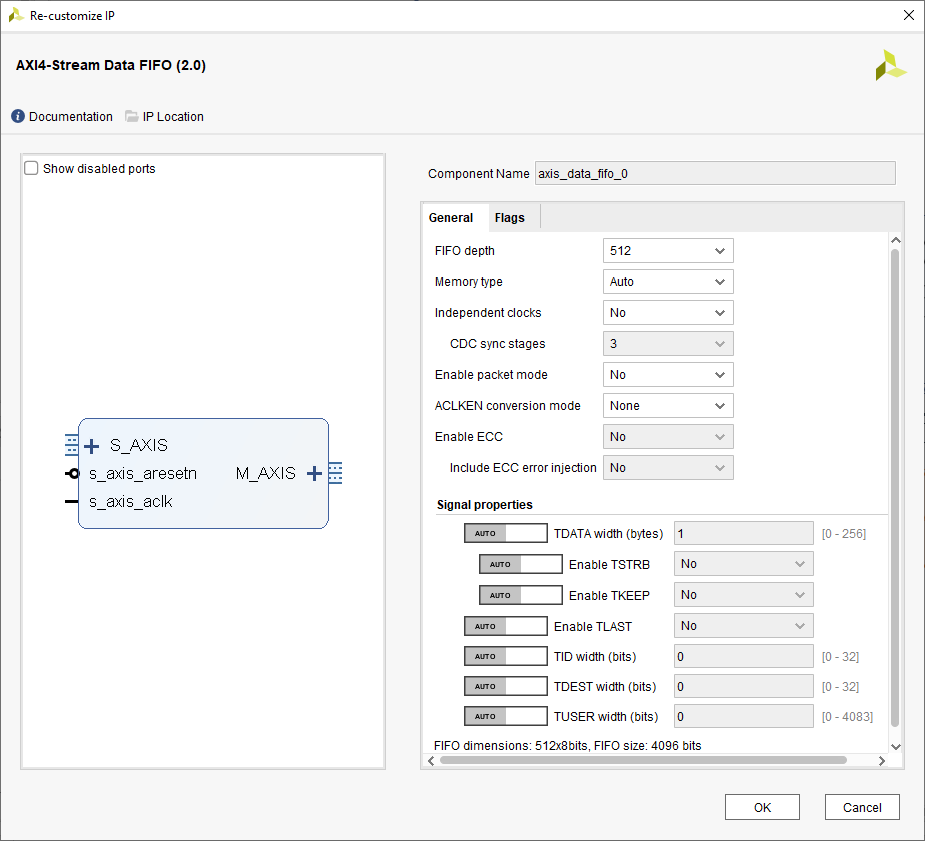

* Make the following connections:
  * DMA: M_AXIS_MM2S -> axis_data_fifo_0: S_AXIS
  * DMA: S_AXIS_S2MM -> axis_data_fifo_0: M_AXIS
  * axis_data_fifo_0: s_axis_aclk to the Zynq PS FCLK_CLK0 (every clock port in this design is connected to this clock)
  * axis_data_fifo_0: s_axis_aclk to the peripheral_aresetn on the *Processor System Reset* block 

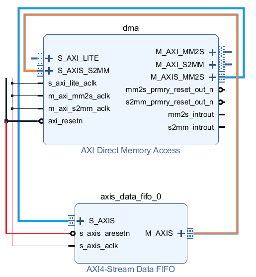

The design is now complete. 

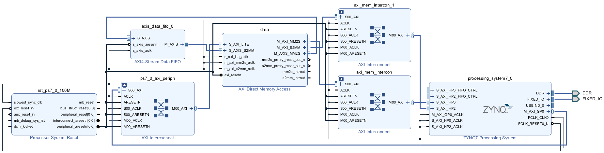

* Press **F6** to run design validation and make sure there are no errors. 

There are no external pins used in this design so no additional constraints are needed. 

* Generate the HDL wrapper and generate the bitstream 

You will need to the .bit file and the .hwh file for this design. These are the files that will be copied to the board to test the design with PYNQ. 

The next part of this tutorial will show how to use the DMA hardware design from PYNQ. 

 

