# Tutorial: using a HLS stream IP with DMA tutorial (Part 1: HLS design)

In a [previous tutorial](https://discuss.pynq.io/t/tutorial-pynq-dma-part-1-hardware-design/3133?u=cathalmccabe) I showed how to use the AXI DMA to stream data between memory to AXI stream interfaces. The DMA tutorial used an AXI stream FIFO to do a loopback test to show how to use the DMA. This tutorial will show how to create and add a HLS IP with an AXI input stream, and AXI output stream. This tutorial will be split into two parts. This *part 1* shows how to build the HLS IP, [part 2](https://discuss.pynq.io/t/tutorial-using-a-hls-stream-ip-with-dma-tutorial-part-2-vivado-design/3345?u=cathalmccabe) shows how to build the Vivado hardware design and [part 3](https://discuss.pynq.io/t/tutorial-using-a-hls-stream-ip-with-dma-part-3-using-the-hls-ip-from-pynq/3346?u=cathalmccabe) shows how to use the IP with PYNQ. 

This tutorial is based on the **v2.7** PYNQ image and will use Vivado **2020.2** (required for PYNQ v2.7). 

Vitis HLS **2020.2** will be used to build the HLS IP. This version has updated support for generating 

If you are using a different PYNQ version you should be able to follow the same steps in this tutorial, but you should make sure you are using the supported version of Vivado for that PYNQ release. 

The **PYNQ-Z2** board was used to test this design.

## References

If you are new to Zynq design, I recommend you review a [previous tutorial](https://discuss.pynq.io/t/tutorial-creating-a-hardware-design-for-pynq/145?u=cathalmccabe) which shows how to build a Vivado hardware design for use with PYNQ. 


## Get the sources

Xilinx provide an open source repository of [Vitis HLS introductory examples](https://github.com/Xilinx/Vitis-HLS-Introductory-Examples). These examples can be extremely useful for beginners and experienced HLS designers. Rather than write code from scratch, I'm going to use the [using AXI stream with side channels](https://github.com/Xilinx/Vitis-HLS-Introductory-Examples/tree/2021.2/Interface/Streaming/using_axi_stream_with_side_channel_data) example from this repository. You can download the source files from this link. 

## Creating and building the project

When you download the source files, you should have the kernel source file (example.cpp), the testbench (example_test.cpp) and the Tcl file (run_hls.tcl) to build the project. 

You can use the Vitis HLS GUI or create a project, add the files, and build the IP. You can also use Vitis HLS on the command line to build the IP. 

### Vitis HLS GUI

Skip this section if you prefer to use the command line flow. 

* Create a new Vitis HLS project 

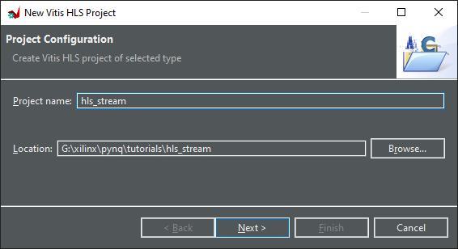

* Add the **example.cpp** as a design file. This file includes the code we will synthesize to hardware.

  Make sure to browse and select the top level **example** function

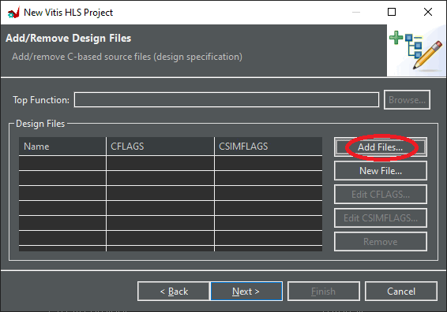

* Click next, and on the next screen add the **example_test.cpp** as a testbench file. This file only includes a testbench for the example() function 

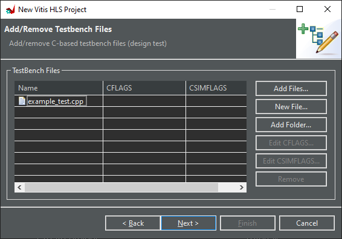

* Select the Zynq part used on your board (or select by board if you installed board files). For the PYNQ-Z2 I select the *xc7z020clg200-1*.

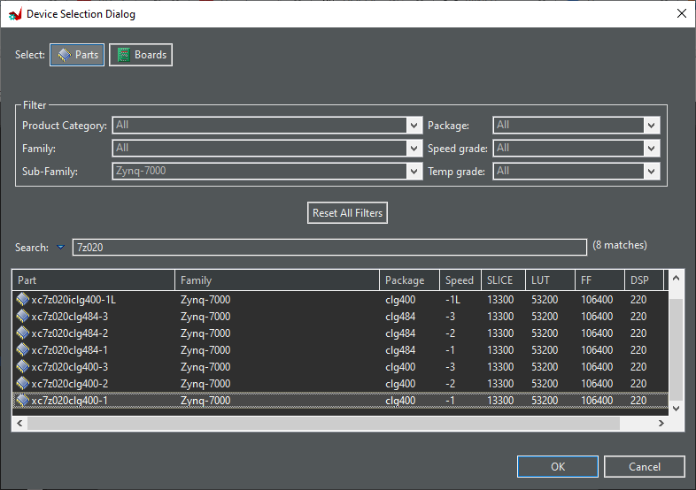

* Review the Solution Configuration. I will leave the default values. The default clock period is 10 ns (100 MHz). If you want to run your design at a different speed, you can change the period.  The final speed your design will run at will be determined when you build the project in Vivado. 

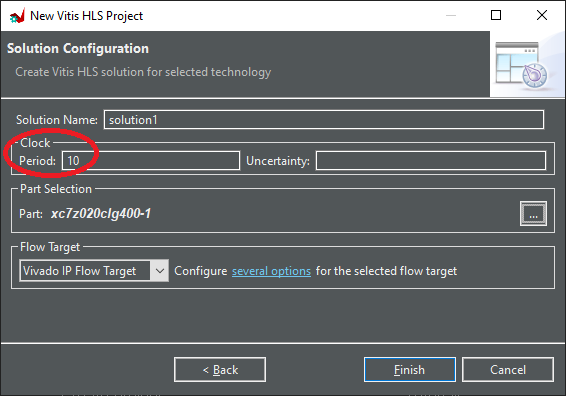

* Click **Finish** to create the project.

## Explore and modify the code

Under sources open *example.cpp*

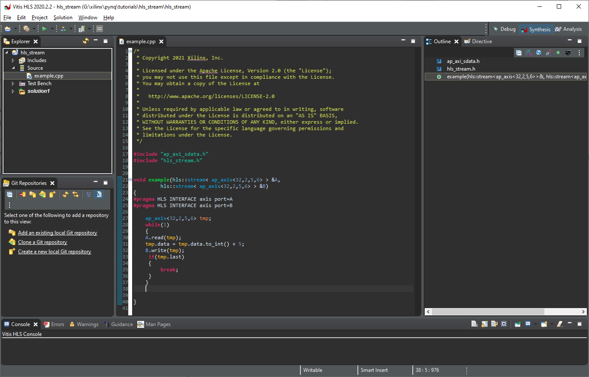

The code has a function with one input AXI stream, and one output AXI stream.  

```c++
    void example(hls::stream< ap_axis<32,2,5,6> > &A,
	hls::stream< ap_axis<32,2,5,6> > &B)
```

This is the main part of the kernel code :

```c++
    while(1)
    {
	A.read(tmp);
	tmp.data = tmp.data.to_int() + 5;
	B.write(tmp);
     if(tmp.last)
     {
         break;
     }
    }

```

The function will read data from an input stream (A), add 5 and write out the value. You would change this code to implement your own algorithm. 

The following **PRAGMAS** will specify that A and B should be implemented as *AXI STREAM* interfaces (**axis**). 

```c++
#pragma HLS INTERFACE axis port=A
#pragma HLS INTERFACE axis port=B
```

Vitis HLS will automatically determine if the streams are inputs or outputs based on how they are used in the code. 

* Add the following **PRAGMA** to add an AXI Lite control interface to the IP and save *example.cpp*.

```c++
#pragma hls interface s_axilite port=return
```

This is optional and allows us to use a control register to start and stop the IP (and auto-start), and check if the IP is "done" (has completed). If you don't need to control the IP, you can skip this and just have a simple stream-in and stream-out which will automatically process any data it receives. 

The pragma can be added after the other two *INTERFACE* PRAGMAs.

## Build the project

This is not intended to be a detailed tutorial on the HLS GUI. You can explore other options yourself, including running the testbench for this simple design. Remember that you modified the kernel code, so you will need to modify the self-checking testbench.  

* Build the project by clicking the build button . 

You can click on the thumbnail to view the full details from the synthesis report. 

[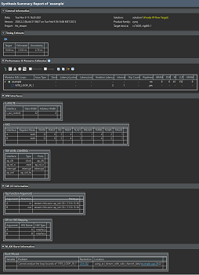](./images/hls/synthesis_report_large.png)


### HW Interfaces

I won't go through all the sections of this report. Review the HW interfaces section to see the A_AXILITE interface we added by including with the PRAGMA we added to the source code. This is the 32-bit control interface. 

Notice the AXIS (AXI STREAM) interfaces for *A* and *B*. 

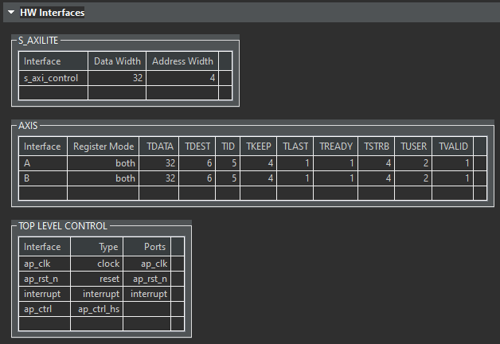

Notice that a full AXI stream interface has been added. i.e. sideband signals have been included: TDEST, TID, TKEEP, TLAST, TSTRB, TUSER. The **TLAST** signal is optional in the AXI stream protocol and can be omitted by the HLS tools if it is not explicitly used as is done in this example. However, it is required by the AXI DMA so we need to make sure it is included for this example. This can be a common problem when using the AXI DMA, so you should make sure TLAST is included in your AXI Stream interfaces. 

## Export the IP

* From the menu bar select **Solution > Export IP**

  I will leave the default values. 

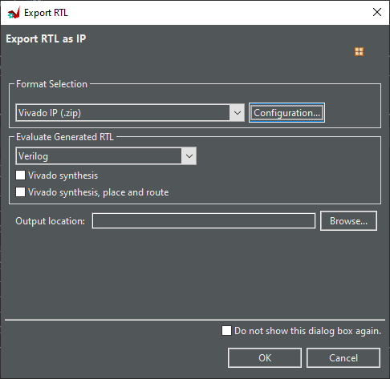

You can make some modifications by clicking on *Configuration*. These names will make the IP easier to identify or organise in the Vivado IP catalog.

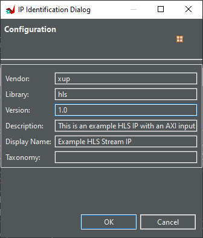

* Click **OK** to export the IP

You can monitor the progress of the export in the *Console*. This usually takes less than 1 minute. 

```
Starting export RTL ...
...
Finished export RTL.
```

You can find the exported IP in your project directory inside **solution1/impl/ip**:

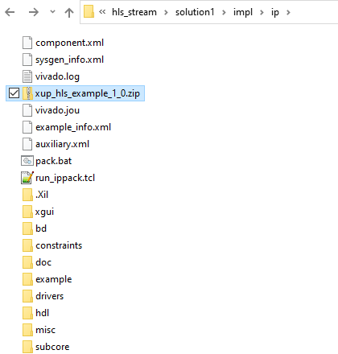

Notice the zip file , which is an archive of all the other files and folders in this directory which make up the packaged IP. The files and folders make up the packaged IP including hardware source code, example software drivers and information about the IP. There are some extra temporary and other files (E.g. Tcl, log and journal files) here that aren't needed. The Zip file in this directory is an archive of the packaged IP which doesn't include those extra files. You can move the Zip file and extract it somewhere else or move it to another computer. 

Inside the **./hdl/** folder, you will see the Verilog or VHDL source files that have been generated by the HLS tools. You don't usually need to look at the contents of these files. They are intended to be easily (human) readable HDL files.

In **./drivers/example_v1_0/src** open the *xexample_hw.h* file. This file includes the register map for the IP. This information will be accessible from the PYNQ *register_map* later. 

For example, we can see the control register will be at offset 0x0. We would write a "1" to *bit 0* to start this IP, and we can readback this register and check *bit 1* to see if the IP has completed its operation. You will see how we do this from PYNQ later 

```
// 0x0 : Control signals
//       bit 0  - ap_start (Read/Write/COH)
//       bit 1  - ap_done (Read/COR)
//       bit 2  - ap_idle (Read)
//       bit 3  - ap_ready (Read)
//       bit 7  - auto_restart (Read/Write)
//       others - reserved
...
// (SC = Self Clear, COR = Clear on Read, TOW = Toggle on Write, COH = Clear on Handshake)
```

### Command line

The source files downloaded from GitHub include a Tcl file (*run_hls.tcl*). This can be used to compile the source files, and export the IP (as we did above) from the command line. 

The Tcl file sets a target device and a clock speed that will be used by Vitis HLS. 

* Open *run_hls.tcl* and review the contents

```tcl
set_part  {xcvu9p-flga2104-2-i}
create_clock -period "200MHz"
```

You should set these values to your target part and target clock speed. 

I will edit the Tcl file and change the part to 7020 for the PYNQ-Z2 and I will set the clock to 100MHz to match the settings we used in the GUI flow. You can choose a different part and clock speed.  

```tcl
set_part  {xc7z020-clg400-1}
create_clock -period "100MHz"
```

You can see that there are a number of options based on the 

* Modify the following: ```set hls_exec 3``` to select the option to build, run cosim, **AND** export the IP

Running cosim isn't required but you may find this interesting. You could comment this line out to save a small amount of build time. 


## Open Vitis HLS command line

* For Windows open the *Vitis HLS Command Prompt* from the Windows start menu, or on Linux open a *terminal* where the Vitis HLS tools are already sourced. 
* Change directory (*cd*) to the source file directory
* Run the following command to build the project and export the IP: ```vitis_hls -f run_hls.tcl```

This will build the project in the source directory. You can modify the paths and build from a different directory if you prefer. 

You can find the files for the packaged IP in a similar directory to the GUI example: 

`./proj_axi_stream_side_channel_data/solution1/impl/ip`

## Part 2

The [next part 2](https://discuss.pynq.io/t/tutorial-using-a-hls-stream-ip-with-dma-tutorial-part-2-vivado-design/3345?u=cathalmccabe) of this tutorial will show how to add this IP to a Vivado design and use the IP from PYNQ. 

 

