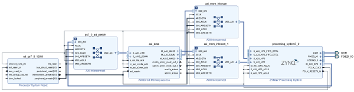
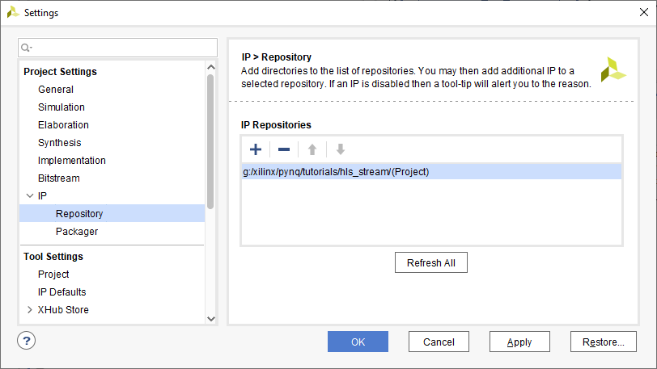
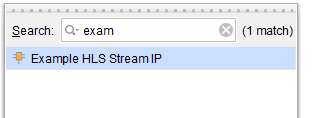
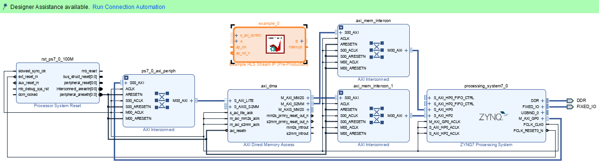
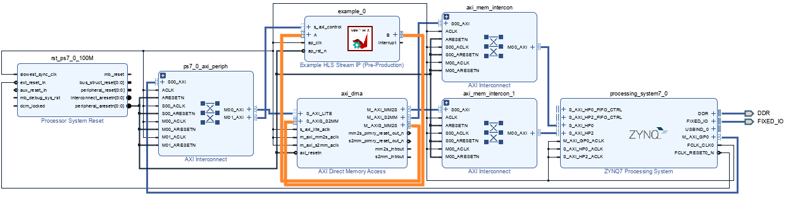

# Tutorial: using a HLS stream IP with DMA tutorial (Part 2: Vivado design)

This is the second part of a tutorial that will show how to create a HLS IP and use it with an AXI DMA controlled by PYNQ. [Part 1](https://discuss.pynq.io/t/tutorial-using-a-hls-stream-ip-with-dma-tutorial-part-1-hls-design/3344?u=cathalmccabe) of this tutorial showed how to build the HLS IP. This part 2 shows how to build the hardware and use the IP with PYNQ. [Part 3](https://discuss.pynq.io/t/tutorial-using-a-hls-stream-ip-with-dma-part-3-using-the-hls-ip-from-pynq/3346?u=cathalmccabe) shows how to use the design with PYNQ.

This tutorial is based on the **v2.7** PYNQ image and will use Vivado **2020.2** (required for PYNQ v2.7). 

Vitis HLS **2020.2** will be used to build the HLS IP. 

If you are using a different PYNQ version you should be able to follow the same steps in this tutorial, but you should make sure you are using the supported version of Vivado for that PYNQ release. 

The **PYNQ-Z2** board was used to test this design.

## Sources

You can find sources for this tutorial in the following [GitHub repository](https://github.com/cathalmccabe/pynq_tutorials). This includes the exported IP from part 1 of the tutorial, and the Tcl file used to rebuild the Vivado project below, along with the output BIT and HWH files from this part of the tutorial. 

## Exported IP

In the first part of the tutorial the IP was exported from HLS to generate a Packaged IP (to IP-XACT format). 

You can find the exported IP in a zip file in your project HLS directory inside the HLS project directory in **solution*/impl/ip**:

You can provide the path of this directory to Vivado, or you can extract the contents of the ZIP file and move them to another location and provide the new path. 

On my computer I will move the IP to `G:/xilinx/pynq/tutorial/hls_stream/`. 

## Vivado project

The DMA design will be similar to the design used in the previous lab. I will not go through the hardware design in detail. A `dma_axis_ip_example.tcl` file is included in the sources for this project which can be used to rebuild the base part of the Vivado project - it will create a Vivado project, add an IPI block diagram with the Zynq PS7 and associated blocks and an AXI DMA. It will make connections between these blocks, but it will leave the AXI Stream interfaces on the DMA unconnected. The HLS IP will be added and connected to these ports.

### Create the base design

* Open Vivado, change to an appropriate directory and `run source dma_axis_ip_example.tcl` to rebuild the base design that includes the AXI DMA. 

### Add the HLS IP

* In Vivado in the *Flow Manager*, click on *settings*, expand *IP*, and in the *Repository* settings, add the path to the HLS IP 

Vivado will search and identify any packaged IP in subdirectories under the directory you select. Notice in the screenshot I selected the top-level project directory. Vivado will search this repository recursively for any IP and add it to the catalog. I could have selected a lower level subdirectory where the IP exists, or closer to where it exists.  

* Add the IP to the IPI block design

* Run block automation to automatically connect the HLS IP's *AXI control interface* (s_axi_control), the *clock* (ap_clk) and the *reset* (ap_rst_n)

* You can then connect the AXI stream interfaces of the HLS IP to the DMA

  M_AXIS_MM2S -> A

  B -> S_AXIS_S2MM

  (The interrupt won't be used for now and can be left unconnected)

The design is now complete. You can now generate the HDL wrapper, and build the bitstream. There are no external inputs/outputs so we don't need to add any  pin constraints. 

Once the bitstream is complete, you can find the HWH and the BIT file and and copy them to your board running PYNQ, as was done in the previous tutorial. 

# Summary

In this part of the tutorial you saw how to add the generated HLS IP to a Vivado design and connect it to the DMA. In the [final part](https://discuss.pynq.io/t/tutorial-using-a-hls-stream-ip-with-dma-part-3-using-the-hls-ip-from-pynq/3346?u=cathalmccabe) of this tutorial you will see how to use the design from PYNQ.
