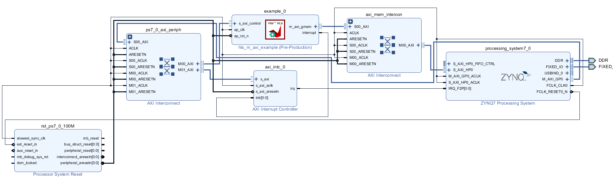

# PYNQ HLS AXI Master tutorial

## References

* Source code and generated files: https://github.com/cathalmccabe/pynq_tutorials/hls_m_axi
* [Vitis-HLS-Introductory-Examples]( https://github.com/Xilinx/Vitis-HLS-Introductory-Examples/)

Previous tutorials
* [PYNQ DMA tutorial](https://discuss.pynq.io/t/pynq-dma-tutorial-part-1-hardware-design/3133)
* [Using a HLS AXI stream IP with DMA from PYNQ](https://discuss.pynq.io/t/tutorial-using-a-hls-stream-ip-with-dma-part-1-hls-design/3344/3)

## Introduction

Previous tutorials show how to build IP with AXI stream interfaces and how they can be connected in a Vivado project to an AXI DMA. The DMA can be controlled from PYNQ to send data to the IP and receive results. 

AXI stream interfaces are useful if you are connecting multiple IP together in a dataflow type architecture. However, you don’t have to use AXI streams and DMAs with HLS IP. HLS supports AXI master interfaces which can read and write data as required - no DMA is needed.

This tutorial will use source code from the [Vitis HLS Introductory Examples repository]( https://github.com/Xilinx/Vitis-HLS-Introductory-Examples/). This is a great resource for learning more about Vitis HLS and includes small code examples demonstrating different techniques you can use in your designs. 

The example code from the [‘Using AXI Master’]( 
https://github.com/Xilinx/Vitis-HLS-Introductory-Examples/tree/master/Interface/Memory/using_axi_master) from 
the *Memory* section will be used. 

## Example design

Review the example.cpp source file. 

The function prototype shows the design has three inputs, *a*, *length*, *value*:

```c
   void example(volatile int *a, int length, int value)
```

The design uses local BRAM memory on the FPGA so that the HLS IP can use burst transfers to access memory. I'm not going to discuss this section of the code in any more detail. You can check the HLS documentation for more details, or explore some of the other examples in the Vitis HLS Introductory examples repository to learn more about building and optimizing your HLS designs. 

The main body of the function has a loop that reads a range of memory locations (the range depends on *length*), and adds a variable *value* to each location and writes the results back to the same memory locations. 

```c
  for(i=0; i < length; i++){
    buff[i] = buff[i] + value;
  }
```

*length* and *value* are inputs to the design. They will be implemented as registers on an AXI Slave interface. We will write values to these registers from PYNQ later. 

The *a* input we saw in the function prototype is the starting address for the memory locations the HLS IP will access.  

Notice the HLS pragma for *a*:
```c
   #pragma HLS INTERFACE m_axi port=a depth=50 offset=slave
```

This declares *a* as an AXI Master interface, of depth 50, with the offset (the offset to the starting memory address) implemented on the slave interface i.e. the AXI Slave control interface. 
To be really clear, *a* will be a AXI Master interface, but we can write the memory offset to a register on the AXI Slave interface. 

If we omit the offset, the HLS IP will access memory locations directly. E.g. If we try to read a[0] this will read from memory location 0x0 in our system. This may be OK if the HLS IP is connected to its own memory and where you as the designer will program the addresses the IP should access. In this design the HLS is connected to PS DRAM which is shared with the ARM processor which is running Linux. We don't know the memory location we want to access in advance, so we use the offset. Later in PYNQ we will allocate some memory and send the address of this memory buffer to the HLS IP. 

## Get the source files 

Clone or copy the following source files from the Vitis HLS Introductory Examples (these files have also been included in the GitHub repository for this tutorial):

•	example.cpp
•	example_test.cpp

The example includes a Tcl file which will build the example for a VU9P. If you are familiar with using Tcl for Vitis HLS project, you can modify this file for your target platform or device. 

In this example I’ll create a new Vitis HLS project using the GUI. I won't show all the steps for the Vitis HLS or the Vivado project. 
If you need help with these sections, check out one of the previous tutorials that show these steps in more detail. 

## Create a HLS new project, 

* Create a new Vitis HLS (2021.1)
* Add example.cpp as a design file 
* Add example_test.cpp as a Testbench file
* Choose the settings for your target platform or device

I am using the PYNQ-Z2 board for this tutorial and set the target clock speed to 100MHz. 

* Build the project 
* Export the IP

The exported IP is generated in IP XACT format and can be imported and used in a Vivado project. 

## Examine the software interface

An example driver is provided in the following directory of the exported IP: 

   `./solution1/impl/ip/drivers/example_v1_0/src`

The `xexample_hw.h` contains details on the register information for the IP. 

Register 0x0 is the control register. 

The "Data signal of a" is the memory address for a. The registers are 32-bit, and the value can be a 64-bit so there are two registers for this value. 
0x10 is the lower 32 bits, and 0x14 is the upper 32 bits. ON the PYNQ-Z2 the PS DRAM is 32 bit so we only ever need to write the lower 32 bits.

0x1c is the offset address for the length.
0x24 is the offset address for the value

Notice the names have been renamed to length_r and value_r. 

```c
	// 0x10 : Data signal of a
	//        bit 31~0 - a[31:0] (Read/Write)
	// 0x14 : Data signal of a
	//        bit 31~0 - a[63:32] (Read/Write)
	// 0x1c : Data signal of length_r
	//        bit 31~0 - length_r[31:0] (Read/Write)
	// 0x20 : reserved
	// 0x24 : Data signal of value_r
	//        bit 31~0 - value_r[31:0] (Read/Write)
```

To use this IP we need to write the memory address of *a*, write the *length* and *value*, and then start the IP. We can choose to start it once, or to also enable autostart which means the IP will run continuously. 
We will use this information later from PYNQ.
 
## Create the Vivado project

* Create a new Vivado project for your target platform or device.
* Create an IP Integrator Block Design
* Add a Zynq block and run block automation, or configure the Zynq subsystem for your target. 

## Add the HLS IP

* In Vivado, in Settings > IP > Repository, add the repository for the exported HLS IP
* Add the HLS IP to the design
* Enable the HP ports on the Zynq block
* Run block automation;
   * Connect the s_axi_control port to the PYNQ M_AXI_GP port
   * Connect the m_axi_gmem to the Zynq S_AXI_HP0 port

Your design should look similar to this:


* Create a HDL wrapper for the Block Design and build the bitstream.

When the build is finished, copy the .bit file and the .hwh file to your PYNQ board. 

## Configuring and starting the IP. 

You need to do the following in PYNQ

* Allocate some space in memory for the input data and the results
* Send the memory address or the "Offset" to the HLS IP so it knows where to read/write data
* Start the IP

Once the IP is started, the HLS IP will read data from PS memory, and write results back to memory.

A Jupyter notebook is provided with this tutorial and includes the code to carry out all these steps. 
* [https://github.com/cathalmccabe/pynq_tutorials/hls_m_axi/hls_m_axi_example.ipynb](https://github.com/cathalmccabe/pynq_tutorials/hls_m_axi/hls_m_axi_example.ipynb)

The key steps are to identify the registers that are used to write the memory address, and the length and value. This is done with the PYNQ `register_map` attribute.


```python
   my_ip.register_map
```

```console
	RegisterMap {
	  CTRL = Register(AP_START=0, AP_DONE=0, AP_IDLE=1, AP_READY=0, RESERVED_1=0, AUTO_RESTART=0, RESERVED_2=0, RESERVED_3=0, RESERVED_4=0),
	  GIER = Register(Enable=0, RESERVED=0),
	  IP_IER = Register(CHAN0_INT_EN=0, CHAN1_INT_EN=0, RESERVED=0),
	  IP_ISR = Register(CHAN0_INT_ST=0, CHAN1_INT_ST=0, RESERVED=0),
	  a_1 = Register(a=write-only),
	  a_2 = Register(a=write-only),
	  length_r = Register(length_r=write-only),
	  value_r = Register(value_r=write-only)
	}
```

We'll use the PYNQ `allocate()` method to allocate a physically contiguous memory buffer that will then be used by the HLS IP.

```python
	from pynq import allocate
	import numpy as np 
	py_buffer = allocate(shape=(100,), dtype=np.int32)
```

Data can then be written to the registers:

```python
	my_ip.register_map.a_1 = py_buffer.physical_address
	my_ip.register_map.length_r = 100
	my_ip.register_map.value_r = 7
```

We can then start the IP by setting the AP_START bit in the control register.

```python
   my_ip.register_map.CTRL.AP_START=1
```

Finally the AP_DONE bit can be checked to determine if the IP is finished processing the data. 

```python
   my_ip.register_map.CTRL.AP_DONE
```


 
