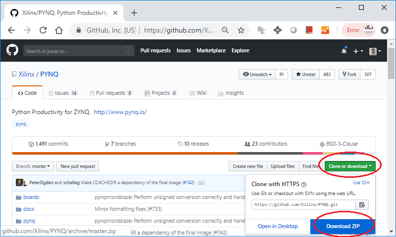
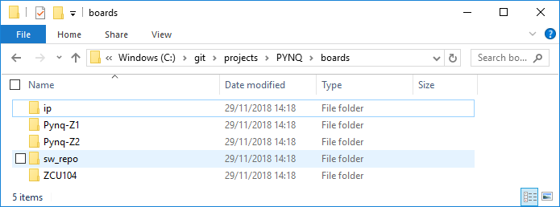
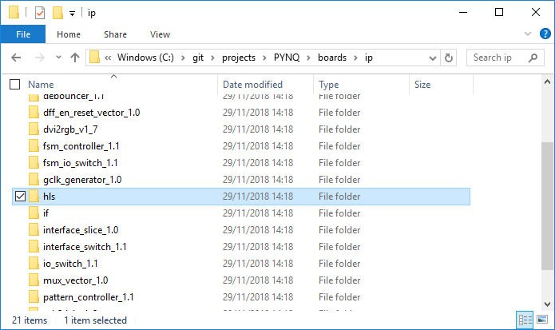
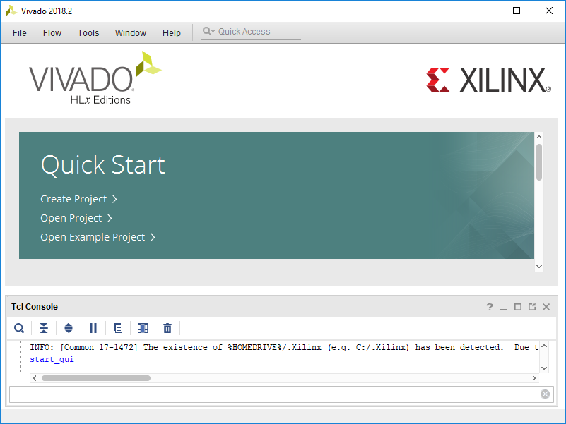
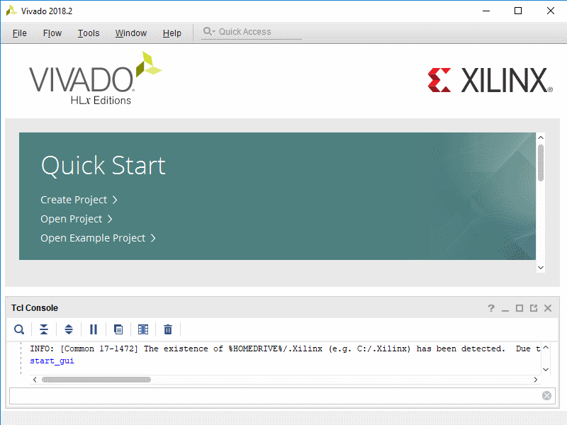
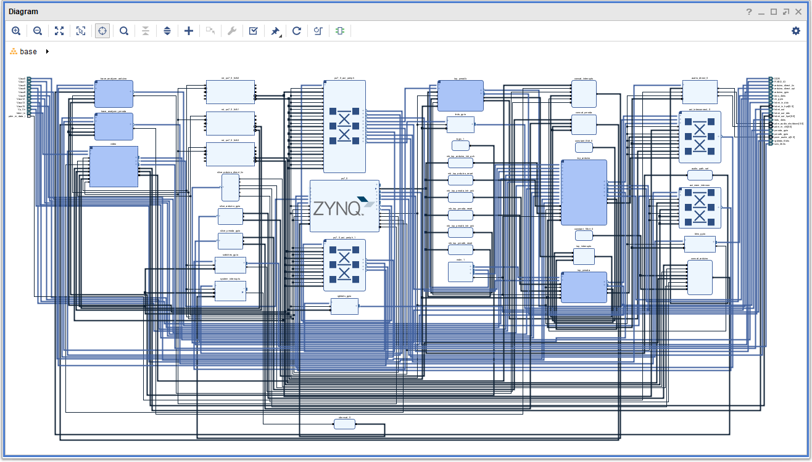

# Rebuilding the PYNQ base overlay

This tutorial will show how to rebuild the PYNQ base overlay for the PYNQ-Z1/PYNQ-Z2 boards. This tutorial is based on the v2.3 PYNQ repository and uses Vivado 2018.2

### Clone the PYNQ repo

Start by cloning the PYNQ GitHub repository. (Or you can fork it to your own repository and clone your fork.)

```console
git clone https://github.com/Xilinx/PYNQ
```

Alternatively, a Zip of the repository can be downloaded from GitHub if you don't use Git:



The PYNQ v2.3 repository contains the following directories:

* *boards* - board specific source code, including the Vivado project sources for the base overlay
* *docs* - sources for the PYNQ documentation on http://pynq.readthedocs.io
* *pynq* - the core PYNQ Python and other source code
* *sdbuild* - source code and instructions for rebuilding the PYNQ image

This tutorial will use the files in the *boards* folder. 

PYNQ v2.3 supports three boards, PYNQ-Z1, PYNQ-Z2, ZCU104. In the *boards* directory, you will see a corresponding directory for each board, along with an *ip* directory and a *sw_repo* directory. 



The XIlinx Vivado software contains a library of IP that can be used for building new designs. The PYNQ *ip* directory contains additional custom IP that isn't available in the main Vivado IP library. For example, the IP for the HDMI controllers for the PYNQ-Z1 and PYNQ-Z2 can be found in the *ip* directory. 

The *sw_repo* directory contains software source code related to overlays. 

For example, PYNQ can use MicroBlaze soft processors in the fabric. Source code for MicroBlaze applications is specific to overlays, and is included here, rather than in the main *pynq* Python directory at the top level of this repository. 

This tutorial will concentrate on the base overlay for the PYNQ-Z1 board. The base overlays for other boards can be rebuilt in a similar way.

## Rebuild the base design

The *base* overlay is built from IP in the Vivado catalog, and IP in the *ip* directory. Some of the PYNQ IP is based on HDL code and other IP is provided as HLS source code (notice the *hls* directory). 



Before HLS IP can be used in a Vivado design, the base design in this case, the HLS IP must be built or compiled. 

### Build required IP

* Open Vivado (2018.2)



A TCL script is provided to rebuild the HLS IP required for this design. (./boards/Pynq-Z1/base/build_base_ip.tcl) 

This script will only build IP in the *ip/hls* directory that is required for the base overlay. It also checks if the IP has already been build. This means if you need to use the IP in another design, or want to rebuild the *base* overlay later, the IP won't be recompiled, saving some time. 


 A second Tcl file, ( ./pynq/boards/Pynq-Z1/basebase.tcl) will be used to create a new Vivado project, generate the *base* overlay design, and compile it to generate the bitstream. 


To run the Tcl files, enter the following commands in the Vivado Tcl console: 

```console
   cd <PYNQ repository>/boards/Pynq-Z1/base
   source ./build_base_ip.tcl
```



The `base.tcl`will generate a bitstream, which may take some time depending on the computer that you are using. If you want to create the design without compiling and generating the bitstream, find the following line in the base.tcl file and comment it out. (Remember the compiled bitstream is already on your board, so it isn't necessary to rebuild it.)

`launch_runs impl_1 -to_step write_bitstream -jobs 4`

Execute the following command in the Tcl console. 

```console
   source ./base.tcl`
```

If you chose not to generate the bitstream in the Tcl file, you can generate it later in Vivado by clicking on the *Generate Bitstream* button.

The base overlay is already installed in the PYNQ image for the PYNQ-Z1/PYNQ-Z2 boards. If this was a new overlay, the .bit and .tcl could be copied to the board. This will be covered in a later tutorial. 

The block design for the *base* overlay should now be created. 



The *base* design contains a large number of IP blocks and design elements which will be explored in the next tutorial. 

## Terminology

Vivado - Xilinx software for building hardware designs for Zynq
IP - Intellectual Property - hardware blocks that implement a function. IP blocks can be reused to create new hardware designs. 
git - version control system
IP-XACT - an XML format for IP that defines and describes individual blocks. Xilinx IP in Vivado is based on this format. IP-XACT makes it easier to use IP to create new designs. 
HLS - High Level Synthesis allows hardware designs to be created by describing them using higher level languages (mainly C/C++) instead of VHDL or Verilog. 